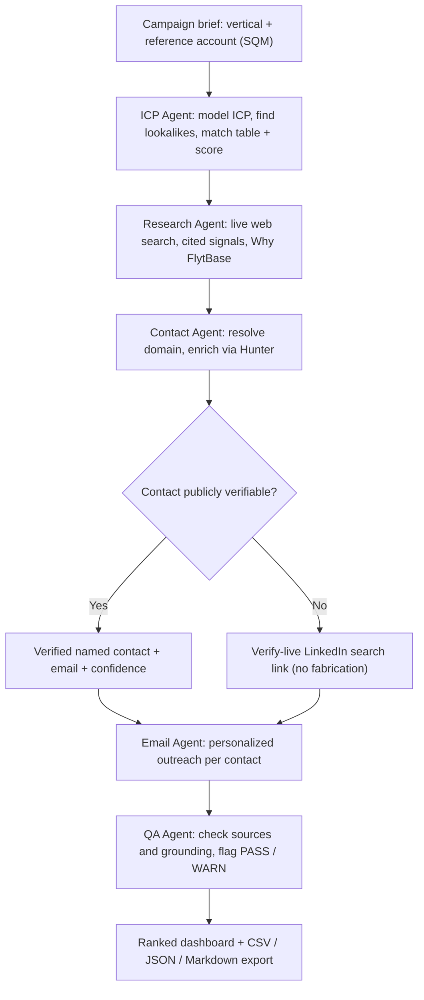

# bdr-engine-oss
# Outbound BDR Engine

An open-source, five-agent system that turns **one campaign brief** into a full outbound package — ranked accounts, evidence-backed ICP matches, cited research, verified contacts, and personalized outreach. You build the engine; the engine writes the emails.

**Live app:** https://bdr-engine-oss-lxd4cfj34zvbvucqmuw7xg.streamlit.app

Built for the FlytBase Outbound BDR hackathon. Reference brief: large-scale lithium / copper / iron-ore mining in Latin America, anchored on SQM.

---

## Thought process

Finding companies, researching them, finding the right people, and writing to them are genuinely different jobs — so instead of one mega-prompt, the work is split across **five specialist agents**, each testable and inspectable. Two principles shape everything:

- **No fabrication.** Every research signal carries a real source; contacts are verified emails or a verifiable live LinkedIn search link — never an invented person.
- **Prioritization over activity.** Accounts are scored and ranked with an evidence match table, so a rep knows who to call first — outcomes, not dials.

It's a **compounding system, not a one-off campaign**: point it at any vertical, geography, or reference account and it runs the same pipeline.

## Architecture / flow



The pipeline **fans out** — one brief becomes many accounts, each account many contacts, each contact its own email — and streams a **live reasoning panel** as each agent runs.

## The five agents (`agents.py`)
1. **ICP Agent** — models the ICP from the reference account and finds real lookalikes, each with an SQM-vs-candidate feature match table and a calibrated match score.
2. **Research Agent** — live web search per account (Tavily, DuckDuckGo fallback), attaching a source URL and date to every insight, plus a "Why FlytBase" fit (use-cases + priority).
3. **Contact Agent** — resolves the company domain, enriches via Hunter for verified emails with a confidence score, and falls back to a verifiable LinkedIn search link.
4. **Email Agent** — writes a personalized email per contact, anchored to a real signal and referencing FlytBase's real proof points.
5. **QA Agent** — checks source coverage and email grounding, flagging PASS / WARN. Nothing unverified reaches the output.

## Tech stack
Streamlit (UI + hosting) · Groq (open Llama model) · Tavily search with DuckDuckGo fallback · Hunter.io (verified emails). Fully open-source, no vendor lock-in.

## Run locally
```bash
pip install -r requirements.txt
export GROQ_API_KEY=your_key        # required (console.groq.com)
export TAVILY_API_KEY=your_key      # optional, reliable search (app.tavily.com)
export HUNTER_API_KEY=your_key      # optional, verified emails (hunter.io)
streamlit run app.py
```

## Deploy (Streamlit Community Cloud)
Push to GitHub → share.streamlit.io → New app → main file `app.py` → add the keys above under **Settings → Secrets**.

## Notes & limitations
- Research depth is bounded by the search tier; next step is a deeper multi-source crawl with a citation on every individual claim.
- Contact coverage depends on public data; next step is wiring in Apollo / Clay for fuller enrichment.
- Scores are model-generated (calibrated via prompt guidance); company discovery is live, so results can vary slightly between runs.
- Transient rate limits are handled with retries and backoff.
